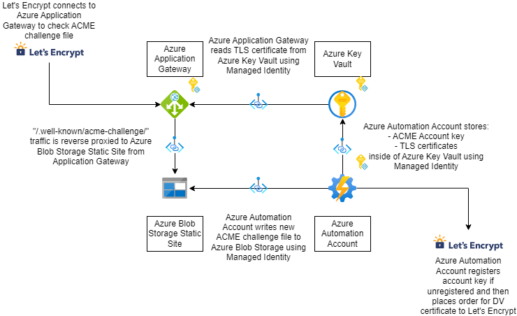

# Better-AGW-ACME

A very simple way to do ACME in Azure, using Let's Encrypt.

# Proposed Architecture



# Features

- Strong keysizes for issued certificates (RSA 4096, SECP384r1)
- HTTP-01 challenges
- Azure Application Gateway aware
- Configures Let's Encrypt to email you with alerts regarding issuance
- Forces "Must Staple" OCSP attribute on certificates, to improve end user privacy
- Supports RFC 8657 accounturi pinning, preventing malicious actors from misissuing certificates
- Automatically renews certificates after 10% of their lifetime has passed, which is ~9 days currently
- Automatically pushes certificates to Azure KeyVault
- Automatically fetches account key from Azure KeyVault
- Automatically generates and places account key in Azure KeyVault if one has not been set
- Automatically registers account key at the CA if account key is unregistered
- Does not expose any user maintained web server, instead relies on Azure Blob Storage Static Websites
- Runs cheap as chips, you pay mere cents per month to Microsoft for running this
- Fully uses Azure Managed Identity - no manual credential management. ever.
- Minimal maintenance overall
- No BS. If this has even a hint of BS anywhere, it is a bug. File an issue.

# DNS configuration of CAA records to significantly improve ACME security

In order to significantly improve overall ACME assurance, you must configure a CAA record for your DNS zone. This is a "set it and forget it task". One of very few such tasks in the IT industry.

For example, for my hostname I wish to issue certificates for, subdomain.domain.tld, I could assign a CAA record to either domain.tld, which would impact the entire apex DNS zone and all children, or I could just do it for subdomain.domain.tld.

Here is what the DNS record would look like in BIND format:

```subdomain.domain.tld. 3600 IN CAA 0 issue "letsencrypt.org; validationmethods=http-01; accounturi=https://acme-v02.api.letsencrypt.org/acme/acct/1337"```

Note, you would replace the "1337" in the above DNS record, with that of the account ID (not account key) which is stored in Azure KeyVault.

This will do 3 things:

- Prevent other CAs other than Let's Encrypt from issuing TLS certificates for this DNS zone
- Prevent other ACME challenges other than HTTP-01 validation
- Prevent malicious actors from abusing Let's Encrypt using techniques such as BGP and DNS zone hijacking, from issuing certificates, as you have a CAA record pinning the account ID, and the credentials for this account are in your Azure KeyVault

It is strongly reccomended to also deploy DNSSEC, as this will further improve resilience of DNS queries performed by the CA when doing ACME challenges, irrespective of challenge type. Though, the CA/Browser forum doesn't currently mandate this for CA's.
